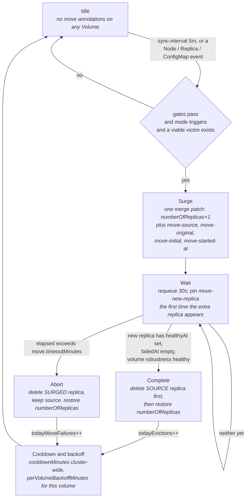
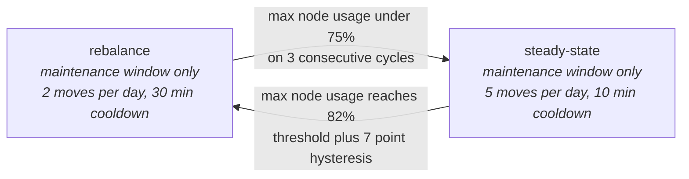

# longhorn-rebalancing-controller

> A Kubernetes controller that rebalances [Longhorn](https://longhorn.io) replica placement by
> scheduled storage bytes, not replica count.

[](https://github.com/vollminlab/longhorn-rebalancing-controller/actions/workflows/ci.yml)
[](https://github.com/vollminlab/longhorn-rebalancing-controller/actions/workflows/build.yml)


Longhorn's built-in `replica-auto-balance: best-effort` only counts replicas per node, not bytes.
A node holding three 100 GiB replicas and a node holding three 1 GiB replicas look identically
balanced to it. This controller closes that gap by moving over-placed replicas onto less-loaded
nodes — and it does so with a **surge-move**: it adds a replica before it removes one, so
redundancy never drops below the volume's configured `numberOfReplicas` at any point.

---

## Why the mechanism is a surge-move and not an eviction

Two earlier designs were tried and both are dead ends, which is worth knowing before anyone
"simplifies" this back:

- **Replica-level `spec.evictionRequested`** (the v0.2.0 mechanism) does not work. Longhorn's
  NodeController owns that flag and force-reverts any external write to it with
  `EvictionCanceled`.
- **A bare `numberOfReplicas` shrink** after the new replica is healthy does not work either.
  Longhorn's own excess-replica cleanup (`cleanupAutoBalancedReplicas`) picks its victim by
  ascending `storageAvailable`, and on 2026-07-22 that tore down the *freshly built* replica
  instead of the source. So the controller deletes the source Replica CR itself, **before**
  restoring the spec — with the spec still surged, Longhorn has no excess healthy replica to
  clean up and can never pick its own victim.

All move state lives in annotations on the Volume CR, so a controller restart mid-move resumes
from the CR alone.

| Annotation | Holds |
|---|---|
| `rebalancer.vollminlab.com/move-source-replica` | name of the replica to delete on completion |
| `rebalancer.vollminlab.com/move-original-replicas` | pre-surge `spec.numberOfReplicas` |
| `rebalancer.vollminlab.com/move-initial-replicas` | comma-joined pre-move active replica names |
| `rebalancer.vollminlab.com/move-started-at` | RFC3339 start time, used for the timeout |
| `rebalancer.vollminlab.com/move-new-replica` | surged replica, pinned once it first appears |

The presence of `move-source-replica` on any Volume *is* the "a move is in flight" flag — there is
no separate lock, and only one move can run cluster-wide at a time.

## The surge-move state machine



Three things in that machine are load-bearing and easy to get wrong:

1. **`Wait` is re-entered without passing back through `Check`.** `Reconcile` progresses an
   in-flight move *before* it evaluates the safety gates. It has to: a surged volume is
   deliberately `robustness: degraded` while its new replica rebuilds, and the gates below reject
   exactly that state — running them first would deadlock every move it started.
2. **The completion check runs before the timeout check.** A replica that turned healthy at
   minute 91 with `timeoutMinutes: 90` completes; it is not thrown away.
3. **An abort is not a completed move.** It burns `move.maxFailuresPerDay`, not the daily move
   cap. Both outcomes start the cooldown clock, though — either way a rebuild consumed disk I/O.

Every Volume write is a JSON merge patch, never a full-object `Update`. `LonghornVolumeSpec` in
`internal/longhorn/types.go` is a deliberately partial type with no `size` field, so a full
`Update` would serialize `spec.size` as absent and `validator.longhorn.io` would reject it as a
volume shrink.

## Two modes



**`rebalance`** recovers from an imbalanced cluster. It triggers when any node's scheduled bytes
exceed `rebalance.nodeUsageThreshold` percent of its Longhorn disk capacity, and it only *starts*
moves inside `rebalance.maintenanceWindow`. A move already in flight finishes outside the window.

**`steady-state`** prevents drift once balanced. It triggers on a ratio instead of an absolute:
the most-loaded node holding more than `steadyState.imbalanceRatio` times the scheduled bytes of
the least-loaded node.

Both modes start moves only inside `rebalance.maintenanceWindow`. Steady-state ignored it until
2026-08-22, when the controller logged `outside maintenance window` at 01:15:58 and
`starting surge-move (steady-state)` sixteen seconds later. A surge-move is a full replica
rebuild, so the setting was being honoured by the mode that moves twice a day and ignored by the
mode that moves five times — the opposite of the intent. The window name still lives under
`rebalance` for config compatibility; it governs both.

The revert edge carries a **7-percentage-point hysteresis** hard-coded as `revertHysteresis` in
`rebalancer.go`. Graduating up requires dropping below 75%; falling back requires reaching 82%.
Without that gap the controller would oscillate between modes at the threshold.

**Mode is in-memory only.** So are the daily counters and the per-volume backoff map. A pod
restart resets the controller to `rebalance` mode with zero moves counted for the day. Only the
in-flight move itself survives a restart, via the Volume annotations.

## Choosing which replica moves, and where

The controller never picks the destination — Longhorn does. What it picks is the *source
replica*, and it only picks one whose move Longhorn can actually carry out and that provably
improves the cluster.

1. **Pick the source node.** In `rebalance` mode, the node with the highest `usagePct`
   — `scheduledBytes / storageMaximum`, summed over disks with `allowScheduling: true`. In
   `steady-state`, the node with the most scheduled bytes.
2. **Filter its replicas to those with at least one realistic destination.** A destination node
   is realistic only if it is not the source, has non-zero capacity, is eligible under the
   volume's StorageClass `nodeSelector` parameter matched against the node's Longhorn tags, and
   does **not** already hold a replica of the same volume. That last one matters: Longhorn's
   replica anti-affinity excludes such nodes, so counting them as destinations models a move
   Longhorn will never make.
3. **Apply two guards to each realistic destination.**
   - **Peak-reduction** — the cluster's highest node load in scheduled bytes must *strictly*
     decrease after the move. This is what makes the controller converge: every accepted move
     lowers the global maximum, so the sequence terminates and cannot ping-pong. It replaced an
     earlier pairwise "no-flip" guard that compared only source against destination — that guard
     structurally forbade relieving a node whose largest replica exceeded every other node's
     headroom, so a 100 GiB replica on a 90%-full node could never move and the controller churned
     smaller volumes forever without relieving the hot node. Peak-reduction also correctly rejects
     the tied-maximum case, where moving off one of two equally hot nodes leaves the twin at the
     peak and nothing improves. Longhorn picks the actual destination, but `postMoveMaxLoad` is
     monotone in destination load — if *any* destination lowers the peak, the least-loaded one
     Longhorn prefers does too.
   - **Free-disk floor** — the destination must still have at least `minDestinationFreePct` of
     its Longhorn disk capacity in *actual* free space after absorbing the replica.
4. **Drop replicas of unattached volumes.** Longhorn's `replenishReplicas` only builds the surged
   replica while the volume is `state: attached`; a move on a detached volume would just hang
   until the timeout.
5. **Drop replicas whose volume moved recently** — within `move.perVolumeBackoffMinutes`. Belt and
   braces on top of peak-reduction: the guard already forces convergence, the backoff stops one
   volume absorbing every move during that convergence.
6. **Pick the victim by size.** `rebalance.smallestFirst` selects the smallest surviving candidate
   — smallest rebuild, shortest degraded window. Note that `steady-state` **hard-codes
   smallest-first** and ignores this setting.

Two different measures of "full" are in play deliberately: the threshold and the peak-reduction
guard use `storageScheduled` (what Longhorn has *promised*), while the free-disk floor uses
`storageAvailable` (what is *actually* free on disk). A thin-provisioned cluster diverges sharply
between the two, and the floor is the one that keeps a rebuild from tripping `NodeDiskSpaceLow`.

## Safety gates

Checked on every reconcile before a *new* move is considered. An in-flight move is exempt — see
the state machine above.

| # | Gate | Enforced when |
|---|---|---|
| 1 | No volume cluster-wide is `robustness: degraded` or `faulted` | `dryRun: false` |
| 2 | No replica is in `status.currentState: rebuilding` | `dryRun: false` |
| 3 | No move already in flight | always |
| 4 | `todayMoveFailures` below `move.maxFailuresPerDay` | `dryRun: false` |
| 5 | Cooldown elapsed since the last move outcome | `dryRun: false` |
| 6 | `todayEvictions` below the mode's `maxEvictionsPerDay` | `dryRun: false` |
| 7 | Now is inside `rebalance.maintenanceWindow` | always, both modes |
| 8 | `dryRun: false` | — the actual patch is skipped otherwise |

Gate 1 tolerates `robustness: unknown`. Detached volumes report `unknown`, and treating that as
unhealthy meant a cluster with any detached volume could never rebalance at all.

The `dryRun: false` column is not a footnote. **In dry-run the gates, the cooldown and the daily
caps are all skipped** — dry-run deliberately shows you the decision it *would* reach from the
current cluster state, unclamped by rate limits. The maintenance window is the exception: it
applies in dry-run too, so a dry-run pod only logs candidate moves between 02:00 and 05:00, in
either mode.

## Longhorn resources read and written

The controller registers a minimal hand-written scheme for `longhorn.io/v1beta2` — only the
fields it needs, no vendored Longhorn dependency.

| Resource | Read | Written |
|---|---|---|
| `nodes.longhorn.io` | `spec.disks[].allowScheduling`, `spec.tags`, `status.diskStatus[].storageScheduled` / `storageMaximum` / `storageAvailable` | never |
| `replicas.longhorn.io` | `spec.nodeID`, `spec.volumeName`, `spec.volumeSize`, `spec.active`, `spec.evictionRequested`, `spec.healthyAt`, `spec.failedAt`, `status.currentState` | deleted — source on completion, surged on abort |
| `volumes.longhorn.io` | `spec.numberOfReplicas`, `spec.storageClassName`, `status.robustness`, `status.state` | merge-patched — `spec.numberOfReplicas` and the move annotations |
| `storageclasses.storage.k8s.io` | `provisioner`, `parameters.nodeSelector` | never |
| `configmaps` | the controller's own config | never |

It watches `Node` (primary), plus `Replica` and its own `ConfigMap` mapped to a single global
reconcile key. Volumes and StorageClasses are listed on each pass, not watched.

`computeNodeStats` still subtracts the size of any replica carrying
`spec.evictionRequested: true` from its node's scheduled bytes. That is a leftover accommodation
for the v0.2.0 eviction mechanism and for evictions triggered by hand in the Longhorn UI; the
controller itself no longer sets that flag.

## Configuration

Config is read from a ConfigMap named `longhorn-rebalancing-controller` in `longhorn-system`.
The controller re-reads it on **every reconcile** and a ConfigMap write also triggers one — no
restart needed. An unparseable or invalid ConfigMap logs an error and falls back to the built-in
defaults; a missing ConfigMap, or one without a `config.yaml` key, silently uses them.

```yaml
apiVersion: v1
kind: ConfigMap
metadata:
  name: longhorn-rebalancing-controller
  namespace: longhorn-system
data:
  config.yaml: |
    dryRun: true                     # safe default — flip to false when ready
    minDestinationFreePct: 25        # free disk % a destination must retain post-move
    rebalance:
      nodeUsageThreshold: 75         # percent; triggers rebalance mode
      maxEvictionsPerDay: 2
      cooldownMinutes: 30
      maintenanceWindow: "02:00-05:00"
      smallestFirst: true            # move smallest replica first, minimises rebuild time
      graduateAfterCycles: 3         # consecutive clean cycles before steady-state
    steadyState:
      imbalanceRatio: 1.5            # most-loaded / least-loaded scheduled-bytes ratio
      maxEvictionsPerDay: 5
      cooldownMinutes: 10
    move:
      timeoutMinutes: 90             # abort a surge-move older than this
      maxFailuresPerDay: 3           # aborted moves before new moves stop for the day
      perVolumeBackoffMinutes: 360   # keep a moved volume off the victim list this long
```

| Key | Default | Validation | Meaning |
|---|---|---|---|
| `dryRun` | `true` | — | Log the decision, skip the patch |
| `minDestinationFreePct` | `25` | `[0, 100)` | Free disk % the destination must retain after absorbing the replica. Keep it above the `NodeDiskSpaceLow` alert threshold of 20% |
| `rebalance.nodeUsageThreshold` | `75` | `(0, 100]` | Scheduled-bytes % of disk capacity that puts the controller in `rebalance` mode |
| `rebalance.maxEvictionsPerDay` | `2` | — | Completed moves per day in `rebalance` mode |
| `rebalance.cooldownMinutes` | `30` | `>= 0` | Minimum gap between move outcomes |
| `rebalance.maintenanceWindow` | `"02:00-05:00"` | `HH:MM-HH:MM` | Window for *starting* moves; overnight spans such as `23:00-02:00` are handled |
| `rebalance.smallestFirst` | `true` | — | Victim selection order. Ignored in `steady-state`, which is always smallest-first |
| `rebalance.graduateAfterCycles` | `3` | `> 0` | Consecutive clean reconciles before entering `steady-state` |
| `steadyState.imbalanceRatio` | `1.5` | `> 1.0` | Max-to-min scheduled-bytes ratio that triggers a steady-state move |
| `steadyState.maxEvictionsPerDay` | `5` | — | Completed moves per day in `steady-state` |
| `steadyState.cooldownMinutes` | `10` | `>= 0` | Minimum gap between move outcomes |
| `move.timeoutMinutes` | `90` | `> 0` | Age at which an in-flight move aborts. Surge rebuild runs roughly 20 min per 100 GiB |
| `move.maxFailuresPerDay` | `3` | `>= 0` | Aborted moves before new moves stop for the day |
| `move.perVolumeBackoffMinutes` | `360` | `>= 0` | How long a moved volume stays off the victim list. `0` disables |

### Command-line flags

The binary reads **no environment variables**. Everything not in the ConfigMap is a flag.

| Flag | Default | Purpose |
|---|---|---|
| `--metrics-bind-address` | `:8080` | Address for the metrics endpoint |
| `--config-map-name` | `longhorn-rebalancing-controller` | ConfigMap holding `config.yaml` |
| `--config-map-namespace` | `longhorn-system` | Namespace of that ConfigMap |
| `--sync-interval` | `5m` | Periodic full-cluster check interval |

Plus the standard controller-runtime zap flags (`--zap-log-level`, `--zap-encoder`, and so on).
The Helm chart sets only `--config-map-name` and `--config-map-namespace`; `--sync-interval` and
`--metrics-bind-address` are not exposed as chart values.

### Metrics

The manager serves the **default controller-runtime and Go runtime metrics** on
`:8080/metrics` — reconcile counts, latency, workqueue depth, `controller_runtime_reconcile_errors_total`.
The controller registers **no custom metrics of its own**, and the chart ships neither a Service
nor a ServiceMonitor, so nothing scrapes the endpoint unless you add them. Rebalancing decisions
are observable through the structured log only: every reconcile logs one `node` line per node with
`scheduledGiB`, `maxGiB`, `usagePct`, `replicas` and the current `mode`, and each move logs
`starting surge-move`, `surge replica scheduled`, and `surge-move completed` or
`surge-move aborted on timeout`.

## Deployment

The image and chart are both published to Harbor by the `Build and Push` workflow, which fires on
any `v*` tag. The image is pushed under both the tag as-is and the bare semver
(`v0.4.0` and `0.4.0`); the chart is packaged with the bare semver as both version and appVersion.

```sh
helm registry login harbor.vollminlab.com

helm install longhorn-rebalancing-controller \
  oci://harbor.vollminlab.com/vollminlab/charts/longhorn-rebalancing-controller \
  --namespace longhorn-system
```

Chart and app version are both **0.4.0**. The chart does not create the namespace; it expects
`longhorn-system` to exist.

### Recommended rollout

1. Deploy with `dryRun: true` — the chart default.
2. Watch the logs for several days. The interesting lines only appear inside the maintenance
   window in either mode, so check the 02:00–05:00 logs specifically.
3. Set `dryRun: false` once the decisions look correct. No restart is needed; the next reconcile
   picks up the ConfigMap change.
4. The controller starts in `rebalance` mode and moves replicas overnight, at most two per day.
5. Once three consecutive cycles show every node under 75%, it graduates to `steady-state` on its
   own.

### Key chart values

| Value | Default | Description |
|---|---|---|
| `image.repository` | `harbor.vollminlab.com/vollminlab/longhorn-rebalancing-controller` | Controller image |
| `image.tag` | `""` — falls back to chart `appVersion` | Image tag |
| `image.pullPolicy` | `IfNotPresent` | |
| `namespace` | `longhorn-system` | Deployment, ConfigMap, ServiceAccount and Role namespace |
| `imagePullSecrets` | `[]` | |
| `resources.requests` | `10m` CPU / `32Mi` memory | |
| `resources.limits` | `100m` CPU / `64Mi` memory | |
| `config.*` | see the table above | Rendered verbatim into the ConfigMap's `config.yaml` |

The pod runs as non-root uid 65532 from a distroless base, with `readOnlyRootFilesystem: true`,
all capabilities dropped and `seccompProfile: RuntimeDefault`. The ServiceAccount sets
`automountServiceAccountToken: false` while the pod spec sets it back to `true` — deliberate, so
the token is mounted only into this pod and not into anything else that happens to use the SA.

### RBAC

**ClusterRole** — cluster-scoped because Longhorn `Node` objects and StorageClasses are:

| apiGroup | Resources | Verbs | Why |
|---|---|---|---|
| `longhorn.io` | `nodes` | `get`, `list`, `watch` | per-node disk capacity and tags |
| `longhorn.io` | `replicas` | `get`, `list`, `watch`, `patch`, `delete` | delete the source on completion, the surged one on abort |
| `longhorn.io` | `volumes` | `get`, `list`, `watch`, `update`, `patch` | surge `numberOfReplicas`, write move annotations |
| `storage.k8s.io` | `storageclasses` | `get`, `list`, `watch` | `nodeSelector` eligibility |
| `""` | `configmaps` | `get`, `list`, `watch` | config |
| `""` | `events` | `create`, `patch` | granted, but the controller emits no Events today |

**Role / RoleBinding** in `longhorn-system` — `get`, `list`, `watch` on `configmaps`, narrowing
the same permission the ClusterRole already grants.

`replicas` carries `patch` and `volumes` carries `update` although the current code paths use only
`delete` and merge-`patch` respectively.

## License

Apache 2.0 — see [LICENSE](LICENSE).
